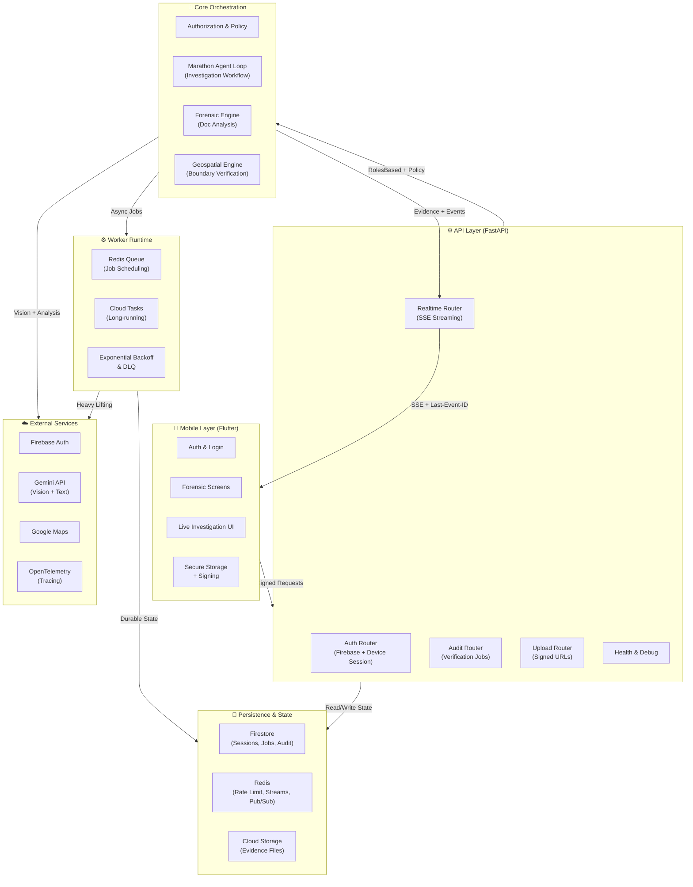
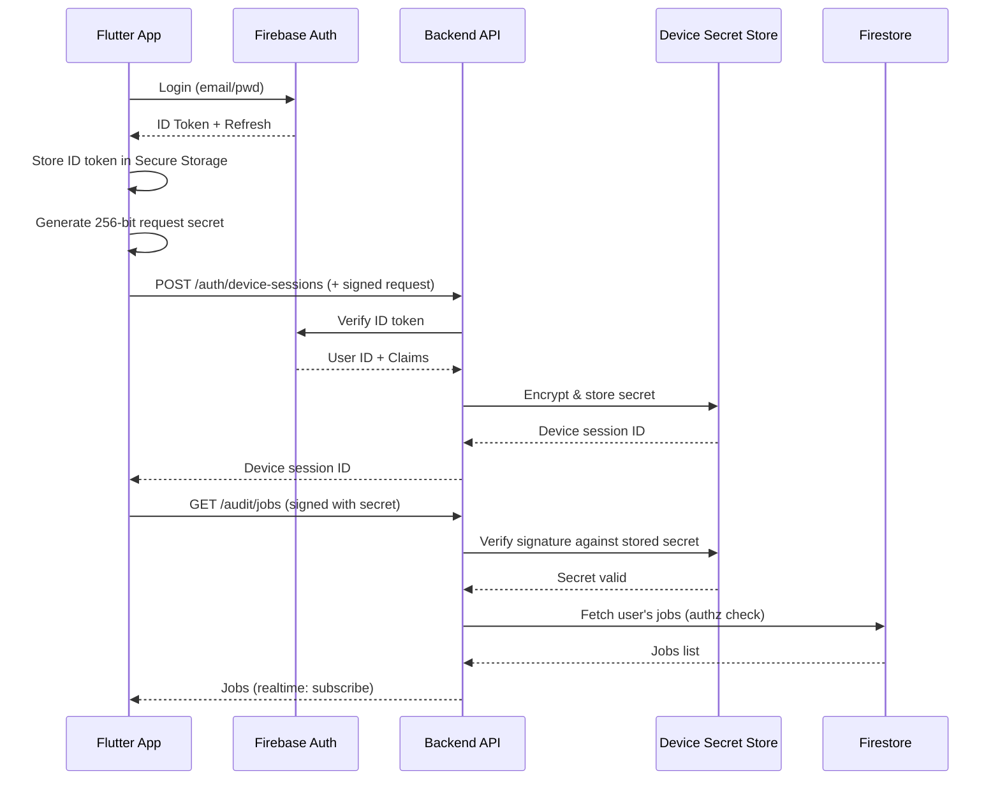
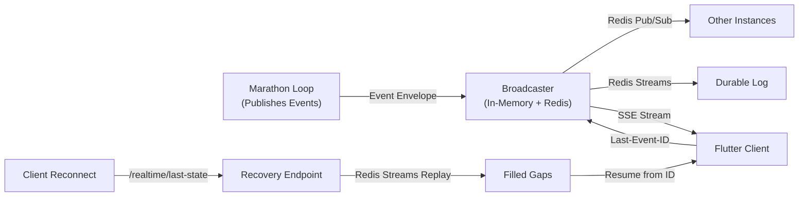
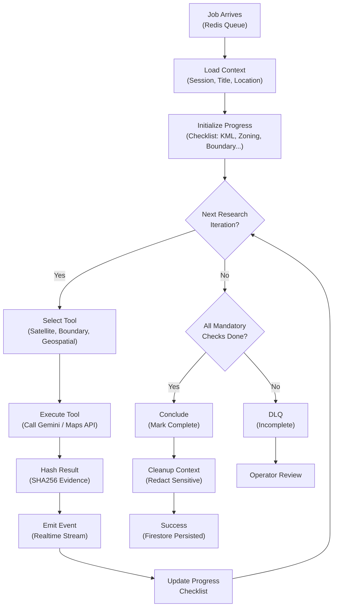

# TitleTrust: Enterprise Land Fraud Detection Platform

> **Production-grade AI-powered investigation platform with forensic evidence integrity, resilient realtime streaming, and security-first architecture.**

[](LICENSE)
[](https://www.python.org/)
[](https://fastapi.tiangolo.com/)
[](https://flutter.dev/)
[](https://firebase.google.com/products/firestore)
[](https://redis.io/)

---

## 🎯 What TitleTrust Does

TitleTrust is a **distributed investigation platform** that combines mobile-first forensic analysis, geospatial intelligence, and AI-assisted land title verification for detecting property fraud in emerging markets. The system ingests satellite imagery, document scans, and boundary data; orchestrates multi-step verification workflows through a resilient agent loop; streams results in realtime to investigators; and maintains forensic-grade evidence integrity with deterministic hashing and audit trails.

**Key capabilities:**

- 🔐 **Forensic Evidence Integrity** — Deterministic SHA256 hashing of findings; tamper-evident audit logs; reproducible results
- ⚡ **Resilient Realtime Streaming** — Redis Streams durable replay, SSE with sequence-aware event dedup, offline-tolerant mobile clients
- 🤖 **AI-Assisted Investigation** — Multi-step Marathon agent loop with Gemini vision, boundary verification, title analysis
- 📍 **Geospatial Intelligence** — Land boundary correlation, satellite imagery analysis, GPS coordinate verification
- 🛡️ **Enterprise Security** — Device-bound request signatures, policy-driven authorization, abuse detection, rate limiting, encrypted secrets
- 📊 **Operational Observability** — Distributed tracing, structured logging, Prometheus metrics, SLO/SLA enforcement
- 🔄 **Distributed Resilience** — Graceful degradation, circuit breakers, DLQ handling, worker retry logic, chaos-validated recovery

---

## 📖 Table of Contents

- [System Architecture](#system-architecture)
- [Core Systems](#core-systems)
  - [Security Model](#security-model)
  - [Realtime Architecture](#realtime-architecture)
  - [AI Agent Orchestration](#ai-agent-orchestration)
  - [Forensic & Geospatial Analysis](#forensic--geospatial-analysis)
- [Operational Excellence](#operational-excellence)
  - [Resilience & Failure Recovery](#resilience--failure-recovery)
  - [Observability & Monitoring](#observability--monitoring)
  - [Performance & Scaling](#performance--scaling)
- [Getting Started](#getting-started)
  - [Local Development](#local-development)
  - [Backend Setup](#backend-setup)
  - [Frontend Setup](#frontend-setup)
  - [Docker & Compose](#docker--compose)
- [Testing Strategy](#testing-strategy)
  - [Unit Tests](#unit-tests)
  - [Integration Tests](#integration-tests)
  - [Chaos & Resilience Tests](#chaos--resilience-tests)
- [Deployment](#deployment)
  - [Production Checklist](#production-checklist)
  - [Kubernetes & Cloud](#kubernetes--cloud)
  - [Environment Configuration](#environment-configuration)
- [API Reference](#api-reference)
- [Threat Model & Security Controls](#threat-model--security-controls)
- [SLO/SLA & Operational Guarantees](#slosla--operational-guarantees)
- [FAQ](#faq)
- [Contributing](#contributing)
- [Project Structure](#project-structure)

---

## System Architecture

### High-Level Overview

TitleTrust uses a **distributed, event-driven architecture** optimized for offline-tolerant mobile clients, long-running investigation workflows, and forensic evidence integrity:



### Component Responsibilities

| Component | Purpose | Key Technologies |
|-----------|---------|-------------------|
| **Mobile App** | Offline-capable investigation UI; device-bound request signing; biometric auth | Flutter, Dart, Secure Storage |
| **FastAPI Backend** | HTTP API gateway; auth validation; request routing; policy enforcement | FastAPI, Pydantic, Middleware |
| **Marathon Agent** | Long-running investigation loop; orchestrates engines; emits realtime events | Async/await, GenAI SDK, Prometheus |
| **Forensic Engine** | Document-level verification (OCR, text, anomalies) | Gemini Vision, PDF parsing |
| **Geospatial Engine** | Boundary correlation, satellite imagery, GPS validation | Google Maps, Satellite Data |
| **Realtime Broadcaster** | In-memory + Redis Streams fanout; event dedup; sequence tracking | Redis Pub/Sub, Redis Streams, SSE |
| **Worker Runtime** | Async job execution; retries; dead-letter handling; metrics | Redis Queue, Cloud Tasks, Prometheus |
| **Firestore** | Source of truth for sessions, jobs, audit logs, policy | Google Firestore, Transactions |

---

## Core Systems

### Security Model

#### Identity & Authentication

1. **Primary Identity**: Firebase ID tokens validated against Firebase Admin SDK
2. **Device Trust Layer**: Per-device 256-bit secret; request signatures via HMAC-SHA256
3. **Policy Enforcement**: Role-based access control expanded to resource-level ownership



#### Security Boundaries

| Zone | Trust Level | Protection | Example |
|------|-------------|-----------|---------|
| **Mobile Client** | Untrusted by default | Local encryption; assume compromise possible | Secure Storage, biometric unlock |
| **Transport** | TLS enforced | Request signatures (HMAC) + timestamp validation | /auth/request-signing.py |
| **Backend API** | Semi-trusted | Identity verification + policy checks per request | /core/authorization.py |
| **Queue & Workers** | Internal untrusted | Payload validation; timeout; poison-pill detection | /workers/runtime.py |
| **Firestore** | Trusted for availability | Server-side authz; repository pattern | /repositories/* |
| **Telemetry** | Observable only | Not authoritative; used for alerts, not decisions | /middleware/observability.py |

**Key Implementation Details:**

- [backend/auth.py](backend/auth.py) — HTTPBearer validation with explicit None checks
- [backend/security/request_signing.py](backend/security/request_signing.py) — HMAC signature verification
- [backend/core/authorization.py](backend/core/authorization.py) — Permission matrix and ownership checks
- [backend/services/device_session_service.py](backend/services/device_session_service.py) — Device secret lifecycle

---

### Realtime Architecture

#### The Challenge

Investigators need **live investigation results** as the backend processes them. Traditional pull-based APIs are latency-heavy and bandwidth-wasteful. WebSockets add complexity on mobile and are proxy-unfriendly. **Solution: Server-Sent Events (SSE) with durable Redis Streams replay.**

#### Event Flow



#### Event Semantics

- **Sequence-aware**: Each event has `event_id`, `sequence_id`, and `timestamp`
- **Deduplicatable**: Client tracks `Last-Event-ID`; server enforces uniqueness
- **Replay-safe**: Event payload is idempotent; can be replayed without side effects
- **Traceable**: `trace_id` and `correlation_id` link to OpenTelemetry spans

**Event Structure:**
```python
{
    "event_id": "uuid:12345",          # Unique across system
    "sequence_id": 42,                 # Per-session monotonic
    "timestamp": "2024-05-20T...",    # Event generation time
    "event_type": "agent.evidence_found",
    "session_id": "sess_...",
    "job_id": "job_...",
    "trace_id": "...",
    "payload": {...}                    # Type-specific data
}
```

#### Redis Streams Durability

When `REDIS_STREAMS_ENABLED=true`:
- Broadcaster appends all events to `titletrust:streams:session:{session_id}`
- Client reconnects can fetch missing events via `/realtime/last-state/{session_id}?since_id=...`
- Streams are pruned to `STREAMS_MAX_LEN` to bound memory usage

**Implementation:**
- [backend/realtime/broadcaster.py](backend/realtime/broadcaster.py) — Event fanout and buffering
- [backend/realtime/store.py](backend/realtime/store.py) — Redis Streams persistence
- [backend/realtime/redact.py](backend/realtime/redact.py) — Payload sanitization
- [backend/api/realtime_router.py](backend/api/realtime_router.py) — SSE endpoint and recovery

---

### AI Agent Orchestration

#### Marathon Loop: Autonomous Investigation Workflow

The **Marathon Loop** is a long-running async loop that orchestrates multi-step land title investigations. It:

1. Fetches a job from the queue
2. Initializes context (title, location, evidence)
3. **Iteratively** runs investigative tools (satellite imagery, boundary checks, title analysis)
4. Emits structured events for each finding
5. Stores forensic evidence with deterministic hashing
6. Marks job as complete or DLQ'd

#### Workflow



#### Investigation Phases

| Phase | Tools | Output | Evidence |
|-------|-------|--------|----------|
| **Document Analysis** | Forensic Engine (OCR, entity extraction) | Title inconsistencies, anomalies | Document hashes, extracted fields |
| **Boundary Verification** | Geospatial Engine (KML, GPS, satellite) | Boundary discrepancies, land use mismatches | Satellite imagery snapshot, coordinates |
| **Zoning & Land Use** | Google Maps, local records | Expected vs. actual zoning | Geospatial evidence, trace IDs |
| **Title History** | Title lookup + LLM analysis | Timeline anomalies, ownership gaps | Title extraction, summary |

#### Implementation

- [backend/agent/marathon_loop.py](backend/agent/marathon_loop.py) — Main orchestration loop
- [backend/agent/tools.py](backend/agent/tools.py) — Tool implementations (satellite, boundary, etc.)
- [backend/agent/vision.py](backend/agent/vision.py) — Gemini API integration
- [backend/agent/context_loader.py](backend/agent/context_loader.py) — Job context initialization

---

### Forensic & Geospatial Analysis

#### Forensic Engine

**Purpose**: Extract and validate document-level evidence from title deeds, property documents, and supporting files.

**Capabilities:**
- OCR and text extraction
- Entity recognition (owner names, dates, amounts)
- Anomaly detection (inconsistent dates, duplicate claims)
- Signature verification (where applicable)

**Evidence Output:**
```python
{
    "status": "success",
    "document_type": "title_deed",
    "extracted_fields": {
        "owner_name": "...",
        "date_issued": "2024-01-15",
        "land_area_sqm": 500.0,
        ...
    },
    "anomalies": [
        {"type": "date_inconsistency", "severity": "HIGH", "details": "..."},
    ],
    "evidence_sha256": "abc123...",
    "provider": "gemini_vision",
    "trace_id": "forensic-xyz"
}
```

**Implementation:** [backend/forensic_engine.py](backend/forensic_engine.py)

---

#### Geospatial Engine

**Purpose**: Correlate land boundaries, satellite imagery, and GPS coordinates to detect mismatches and fraud signals.

**Capabilities:**
- KML/GeoJSON boundary parsing and validation
- Satellite imagery analysis (structures, land use, discrepancies)
- GPS coordinate verification against registered boundaries
- Cross-reference with public land records

**Evidence Output:**
```python
{
    "status": "success",
    "boundary_match": 0.94,  # Similarity score
    "land_use_mismatch": True,
    "ground_truth_issue": {
        "type": "structure_detected",
        "severity": "HIGH",
        "description": "Title claims vacant land but satellite shows structures"
    },
    "coordinates_verified": True,
    "evidence_sha256": "def456...",
    "provider": "geospatial_engine",
    "trace_id": "geo-xyz"
}
```

**Implementation:** [backend/geospatial_engine.py](backend/geospatial_engine.py)

---

## Operational Excellence

### Resilience & Failure Recovery

TitleTrust is designed for **Kenyan land conditions**: unreliable networks, intermittent power, and data scarcity. Resilience is built in, not bolted on.

#### Failure Modes & Recovery

| Failure Mode | Detection | Recovery | RTO |
|--------------|-----------|----------|-----|
| **Backend Instance Down** | Health checks; 503 from LB | Traffic redirects to healthy instance | < 1s |
| **Redis Unavailable** | Connection timeout in broadcaster | Fall back to in-memory queuing (degraded) | 5–10s |
| **Database Query Timeout** | Query latency > threshold | Circuit breaker; return cached state | 2–5s |
| **Worker Crash Mid-Job** | Job heartbeat missed | Exponential backoff retry; max 3 retries | 1–5m |
| **Network Partition** | Timeout on external API calls | DLQ; mark job poison-pill; operator review | 10–30m |
| **Mobile Client Offline** | SSE connection drops | Client queues local changes; reconnects on WiFi/data | 1–5m |

#### Circuit Breaker Pattern

External API calls (Gemini, Maps) are protected by circuit breakers:

```python
# backend/infrastructure/resilience.py
@circuit_breaker(
    failure_threshold=5,
    recovery_timeout=60,
    expected_exception=APIError
)
async def call_gemini_vision(image_data):
    ...
```

**States:**
- **Closed**: Normal operation
- **Open**: Reject requests immediately (fail fast)
- **Half-Open**: Allow one request to test recovery

#### Dead-Letter Queue (DLQ)

Jobs that exceed retry limits are moved to a DLQ for operator review:

```python
# backend/infrastructure/dead_letter_queue.py
class DLQ:
    async def enqueue_poisoned_job(self, job_id, reason, context):
        await firestore.collection("dead_letter_queue").add({
            "job_id": job_id,
            "reason": reason,
            "context": context,
            "created_at": timestamp.now(),
            "operator_reviewed": False,
        })
```

**Operator Actions:**
- Inspect job context and error logs
- Manually retry with corrected input
- Discard if unrecoverable

#### Chaos Testing

TitleTrust validates recovery under chaos:

```bash
pytest tests/test_realtime_chaos.py -k "redis_restart OR worker_crash OR network_partition"
```

**Scenarios:**
- Redis restart mid-stream → expect graceful fallback to in-process
- Worker crash during job → expect exponential backoff and retry
- Network partition between instances → expect degraded local operation

Implementation: [tests/test_realtime_chaos.py](tests/test_realtime_chaos.py)

---

### Observability & Monitoring

#### Distributed Tracing

Every request and job gets a `trace_id` injected at the ingress point:

```python
# backend/middleware/observability.py
@app.middleware("http")
async def add_trace_id(request: Request, call_next):
    trace_id = request.headers.get("X-Trace-ID") or str(uuid.uuid4())
    request.state.trace_id = trace_id
    response = await call_next(request)
    response.headers["X-Trace-ID"] = trace_id
    return response
```

**Propagation:**
- HTTP headers: `X-Trace-ID`, `X-Correlation-ID`
- Firestore documents: `trace_id` field
- Realtime events: `trace_id` and `correlation_id` envelopes
- OpenTelemetry spans: Auto-instrumented

#### Structured Logging

All logs are JSON-structured with context:

```json
{
  "timestamp": "2024-05-20T14:30:00Z",
  "level": "ERROR",
  "logger": "backend.agent.marathon_loop",
  "message": "Boundary verification failed",
  "trace_id": "abc-123",
  "session_id": "sess-xyz",
  "job_id": "job-456",
  "error": "API timeout",
  "retry_count": 2,
  "duration_ms": 5000
}
```

**Log Levels:**
- `DEBUG`: Detailed execution flow (disabled in prod)
- `INFO`: Key lifecycle events (job start, completion)
- `WARNING`: Recoverable issues (retry, degradation)
- `ERROR`: Unhandled exceptions (DLQ candidate)
- `CRITICAL`: System degradation (service restart recommended)

#### Metrics

**Prometheus metrics** measure system health:

```
# Request latency (histogram)
titletrust_http_request_duration_seconds_bucket{path="/audit/jobs", status="200"}

# Job processing
titletrust_job_processing_duration_seconds_bucket{job_type="land_verification"}
titletrust_jobs_completed_total{status="success"}
titletrust_jobs_dlq_total{reason="max_retries_exceeded"}

# Realtime streaming
titletrust_realtime_subscribers_active{session_id="..."}
titletrust_realtime_events_published_total
titletrust_realtime_dropped_events_total{reason="queue_full"}

# External API calls
titletrust_gemini_api_calls_total{operation="vision_analysis", status="success"}
titletrust_gemini_api_duration_seconds{operation="vision_analysis"}
titletrust_circuit_breaker_state{service="gemini", state="closed|open|half_open"}
```

**Dashboards** (Grafana/Datadog):
- Request latency p50/p95/p99
- Error rate and error types
- Job throughput and completion rates
- Realtime subscriber health
- External API availability and latency
- Worker queue depth and retry rate

#### Alerting

**SLA-backed alerts** trigger when:
- Error rate > 1% for 5 minutes
- p95 latency > 2s for 10 minutes
- DLQ size > 10 jobs
- Realtime dropped events > 100/hour
- Circuit breaker open for > 1 minute

---

### Performance & Scaling

#### Horizontal Scaling

**Stateless API instances** scale independently:
- No session affinity required
- Load balancer distributes requests
- Shared Redis and Firestore backend

```bash
# Kubernetes deployment example
kubectl scale deployment titletrust-api --replicas=5
```

#### Database Indexing

Firestore indexes optimize query performance:

```firestore-index
-- Sessions by user and date
db.collection("sessions")
  .where("user_id", "==", user_id)
  .orderBy("created_at", "desc")
  .limit(10)
  -- Index: (user_id, created_at)

-- Jobs by session
db.collection("jobs")
  .where("session_id", "==", session_id)
  .where("status", "==", "in_progress")
  -- Index: (session_id, status)
```

#### Caching Strategy

- **Redis**: Rate limit state (TTL: 60s), sessions (TTL: 3600s), device secrets
- **In-Memory**: Policy cache (TTL: 300s), feature flags
- **HTTP Caching**: Static assets (public, max-age: 86400s)

#### Load Profile

**Typical production load:**
- Concurrent users: 100–1000
- API QPS: 50–500
- Job throughput: 5–20 jobs/sec
- Realtime subscribers: 10–100 per session

**Scaling checklist:**
- [ ] Redis Cluster (not single-instance)
- [ ] Firestore multi-region replication
- [ ] Cloud Tasks auto-scaling
- [ ] API instances behind load balancer
- [ ] CDN for static assets

---

## Getting Started

### Local Development

#### Prerequisites

- **Python 3.9+** with pip and venv
- **Node.js 16+** (for frontend dependencies)
- **Flutter SDK** (latest stable)
- **Firebase CLI** (`npm install -g firebase-tools`)
- **Docker & Docker Compose** (optional, for local Redis/Firestore)
- **Git**

#### Clone & Setup

```bash
git clone https://github.com/yourusername/titletrust.git
cd titletrust
```

### Backend Setup

1. **Create virtual environment:**
```bash
python3 -m venv .venv
source .venv/bin/activate  # On Windows: .venv\Scripts\activate
```

2. **Install dependencies:**
```bash
cd backend
pip install -r requirements.txt
```

3. **Configure environment:**
```bash
# Copy example env file
cp .env.example .env

# Edit .env with Firebase credentials, API keys, etc.
nano .env
```

**Key environment variables:**
```bash
# Firebase
FIREBASE_PROJECT_ID=your-project
FIREBASE_CREDENTIALS_PATH=./firebase-key.json

# Redis
REDIS_URL=redis://localhost:6379
REDIS_PUBSUB_ENABLED=true
REDIS_STREAMS_ENABLED=true

# APIs
GEMINI_API_KEY=your-key
GOOGLE_MAPS_API_KEY=your-key

# Observability
OTEL_EXPORTER_OTLP_ENDPOINT=http://localhost:4317
LOG_LEVEL=DEBUG

# Feature Flags
ENABLE_CHAOS_MODE=false
```

4. **Start local services (optional, with Docker):**
```bash
docker-compose up -d redis firestore-emulator
```

5. **Run the backend:**
```bash
uvicorn backend.main:app --reload --host 0.0.0.0 --port 8000
```

**Check health:**
```bash
curl http://localhost:8000/health
```

Interactive API docs available at `http://localhost:8000/docs`.

---

### Frontend Setup

1. **Install dependencies:**
```bash
cd frontend/titletrust
flutter pub get
```

2. **Configure Firebase:**
```bash
# Initialize Firebase (creates google-services.json, GoogleService-Info.plist)
flutterfire configure --project=your-firebase-project
```

3. **Run on device/emulator:**
```bash
# List connected devices
flutter devices

# Run on Android emulator
flutter run -d emulator-5554

# Run on iOS simulator
flutter run -d iphone-simulator

# Run on real device
flutter run
```

---

### Docker & Compose

**All-in-one local environment:**

```bash
docker-compose up -d
```

This starts:
- FastAPI backend (port 8000)
- Flutter web debug build (port 5000)
- Redis (port 6379)
- Firestore Emulator (port 8080)
- Jaeger tracing (port 16686)
- Prometheus (port 9090)

**View logs:**
```bash
docker-compose logs -f api
docker-compose logs -f worker
```

---

## Testing Strategy

### Unit Tests

**Backend unit tests** cover individual components in isolation:

```bash
pytest tests/unit/ -v --cov=backend --cov-report=html
```

**Examples:**
- `test_forensic_engine.py` — Document analysis logic
- `test_geospatial_engine.py` — Boundary correlation
- `test_request_signing.py` — HMAC verification
- `test_authorization.py` — Permission checks

### Integration Tests

**Backend integration tests** exercise full request/response cycles:

```bash
pytest tests/integration/ -v
```

**Examples:**
- `test_auth_flow.py` — Login → device-session → signed request
- `test_audit_job_creation.py` — Full job lifecycle
- `test_realtime_broadcaster.py` — Event fanout and dedup

### Chaos & Resilience Tests

**Chaos tests** validate recovery under failure conditions:

```bash
pytest tests/test_realtime_chaos.py -v
```

**Scenarios:**
- `test_redis_restart_recovery` — Graceful fallback to in-memory
- `test_worker_crash_retry` — Exponential backoff and DLQ
- `test_network_partition_recovery` — Last-Event-ID replay
- `test_slow_subscriber_dropout` — Bounded queue overflow

### Flutter Tests

**Widget and integration tests:**

```bash
cd frontend/titletrust
flutter test

# Integration test on real device
flutter drive --target=test_driver/app.dart
```

---

## Deployment

### Production Checklist

Before deploying to production:

- [ ] **Secrets**: All API keys, credentials in secure vault (Google Secret Manager, Vault)
- [ ] **HTTPS**: TLS certificates from CA (Let's Encrypt OK for MVP)
- [ ] **Database**: Firestore backups enabled; multi-region replication
- [ ] **Redis**: Cluster mode; RDB + AOF persistence
- [ ] **Monitoring**: Prometheus, Grafana, PagerDuty/Datadog alerts
- [ ] **Logging**: Centralized logs (Cloud Logging, ELK, Splunk)
- [ ] **Tracing**: Jaeger or Google Cloud Trace enabled
- [ ] **Rate Limiting**: Per-user and per-IP limits configured
- [ ] **CORS**: Whitelisted origins only
- [ ] **API Keys**: Rotation schedule (90 days max)
- [ ] **Incident Response**: On-call runbook; postmortem process

### Environment Configuration

**Staging** (non-production user testing):
```bash
export ENVIRONMENT=staging
export LOG_LEVEL=INFO
export REDIS_PUBSUB_ENABLED=true
export REDIS_STREAMS_ENABLED=true
export ENABLE_CHAOS_MODE=false
```

**Production** (live users):
```bash
export ENVIRONMENT=production
export LOG_LEVEL=WARNING
export REDIS_PUBSUB_ENABLED=true
export REDIS_STREAMS_ENABLED=true
export ENABLE_CHAOS_MODE=false
# All API keys from Google Secret Manager
```

### Kubernetes & Cloud

**Cloud Run (recommended for MVP):**

```bash
gcloud run deploy titletrust-api \
  --image gcr.io/your-project/titletrust-api \
  --platform managed \
  --region us-central1 \
  --set-env-vars FIREBASE_PROJECT_ID=... \
  --memory 2Gi \
  --cpu 2
```

**GKE (for larger scale):**

```bash
kubectl apply -f k8s/base/deployment.yaml
kubectl apply -f k8s/base/service.yaml
kubectl autoscale deployment titletrust-api --min=2 --max=10
```

**GitHub Actions CI/CD** (see `.github/workflows/ci.yml`):
- On push to main: build, test, deploy to staging
- On release tag: build, test, deploy to production

---

## API Reference

### Authentication Endpoints

**POST /auth/login**
```bash
curl -X POST http://localhost:8000/auth/login \
  -H "Content-Type: application/json" \
  -d '{"firebase_id_token": "..."}'
```

**POST /auth/device-sessions** (Register device)
```bash
curl -X POST http://localhost:8000/auth/device-sessions \
  -H "Authorization: Bearer <firebase_token>" \
  -H "X-Device-ID: my-device-001" \
  -d '{"device_fingerprint": "..."}'
```

### Audit/Investigation Endpoints

**POST /audit/jobs** (Start investigation)
```bash
curl -X POST http://localhost:8000/audit/jobs \
  -H "Authorization: Bearer <firebase_token>" \
  -H "X-Request-Signature: <hmac>" \
  -d '{
    "title_id": "KE-NAIROBI-2024-001",
    "location": {"lat": -1.286389, "lng": 36.817223},
    "document_urls": ["https://..."]
  }'
```

**GET /audit/jobs/{job_id}** (Get job status)
```bash
curl http://localhost:8000/audit/jobs/job-123 \
  -H "Authorization: Bearer <firebase_token>" \
  -H "X-Request-Signature: <hmac>"
```

### Realtime Endpoints

**GET /realtime/sse** (Subscribe to events)
```bash
curl -H "Last-Event-ID: event-42" \
  http://localhost:8000/realtime/sse
```

**GET /realtime/last-state/{session_id}** (Recovery)
```bash
curl http://localhost:8000/realtime/last-state/sess-123?since_id=event-42
```

Full OpenAPI documentation: `http://localhost:8000/docs`

---

## Threat Model & Security Controls

### Threat Scenarios

| Threat | Attack Vector | Mitigation | Evidence |
|--------|---------------|-----------|----------|
| **Stolen Bearer Token** | Compromised device; token leak | Device-bound request signatures; short token TTL | [backend/security/request_signing.py](backend/security/request_signing.py) |
| **Replay Attack** | Attacker captures signed request | Timestamp validation; nonce/idempotency keys | [backend/api/auth_router.py](backend/api/auth_router.py) |
| **Privilege Escalation** | Forged role claim in JWT | Server-side permission check; policy expansion | [backend/core/authorization.py](backend/core/authorization.py) |
| **Unauthorized Data Access** | Direct Firestore query or JWT forgery | Ownership check; collection-level rules | [backend/repositories/](backend/repositories/) |
| **Job Injection** | Malicious payload in Redis queue | Payload schema validation; type checking | [backend/services/background_job_service.py](backend/services/background_job_service.py) |
| **Denial of Service** | High-frequency requests; large payloads | Rate limiting; request size limits; adaptive throttling | [backend/middleware/rate_limit.py](backend/middleware/rate_limit.py) |
| **Information Disclosure** | Error messages expose internals | Generic error responses; detailed logs server-side | [backend/api/upload_router.py](backend/api/upload_router.py) |
| **Data Tampering** | Modify job state in Firestore | Firestore security rules; audit trail logging | firestore.rules |

### Security Controls

**Defense in Depth:**

1. **Authentication**: Firebase ID tokens + device-bound secrets
2. **Authorization**: Role + permission + ownership checks
3. **Transport**: TLS 1.3, HSTS, CSP headers
4. **Input**: Request schema validation, size limits
5. **Rate Limiting**: Per-user, per-IP, per-endpoint
6. **Abuse Detection**: Anomaly scores, automated throttling
7. **Audit Logging**: All sensitive operations logged with trace IDs
8. **Encryption**: Secrets encrypted at rest; TLS in transit
9. **Secret Rotation**: Device secrets, API keys, credentials
10. **Incident Response**: DLQ triage, operator review, postmortem

---

## SLO/SLA & Operational Guarantees

### Service-Level Objectives (SLOs)

| Metric | Target | Measurement | Alert Threshold |
|--------|--------|-------------|-----------------|
| **Availability** | 99.5% | Uptime over 30 days | < 99.0% for 1 hour |
| **API Latency (p95)** | < 1.0s | Response time over 5 min window | > 1.5s |
| **Job Completion Rate** | 98%+ | Jobs completed / jobs started | < 95% for 30 min |
| **Realtime Freshness** | < 2.0s | Event published → client received | > 3.0s consistently |
| **Error Rate** | < 0.5% | 5xx / total requests | > 1.0% for 5 min |
| **Evidence Integrity** | 100% | Auditable hash mismatches | Any mismatch |

### Recovery Time Objectives (RTOs)

| Failure | Target RTO | Recovery Procedure |
|---------|-----------|-------------------|
| Single API instance | < 1s | Auto-redirect via LB |
| Redis unavailable | 5–10s | Degrade to in-memory; restart Redis |
| Database region down | < 5 min | Firestore multi-region failover |
| DDoS attack | < 2 min | Rate limiter activation; DDoS mitigation |
| Data corruption | < 30 min | Restore from backup; replay events from Streams |

### Operational Invariants

**These must always be true:**

1. **Every finding has a trace ID** — Auditable back to the initiating request
2. **Every job state transition is logged** — Firestore audit trail tracks changes
3. **No duplicate events in realtime** — Client dedup by event_id prevents double-processing
4. **Evidence hash never changes** — SHA256 is deterministic; same input = same hash
5. **All secrets encrypted at rest** — Device secrets, API keys, credentials
6. **Every request is authenticated** — Even health checks, unless whitelisted
7. **Rate limits apply to all users** — No exceptions; abuse scores increase with violation

---

## FAQ

**Q: Why SSE instead of WebSockets?**
A: SSE is simpler for mobile, works with proxies/load balancers, and HTTP infrastructure is well-understood. For high-frequency streams, WebSockets might be considered, but current event frequency (~10 events/sec per job) is well-suited to SSE.

**Q: What happens if Redis goes down?**
A: Broadcaster falls back to in-memory event fanout. Multi-instance fanout is degraded (events don't cross instances), but single-instance functionality remains. Restart Redis; events from Streams (if enabled) will be replayed on reconnect.

**Q: Can I run TitleTrust without Firebase?**
A: Not recommended. Firebase Auth simplifies identity and integrates with Firebase Messaging. To use a different auth provider, you'd need to swap [backend/auth.py](backend/auth.py) and update the identity boundary. Device-session signing would still be recommended.

**Q: How do I rotate API keys?**
A: Create new keys in Google Cloud Console or your secret manager. Update environment variables. Rolling restart of API instances. Old keys can be deactivated after successful rollout. Test rotation in staging first.

**Q: What's the maximum job duration?**
A: Default is 30 minutes. Can be tuned via `JOB_TIMEOUT_SECONDS` env var. Jobs exceeding timeout are marked as poison-pill and DLQ'd.

**Q: How do I debug a failing job?**
A: 
1. Find job in Firestore: `db.collection("jobs").doc(job_id)`
2. Check `status`, `error_message`, `retries`
3. If in DLQ, inspect context and error logs
4. Use trace_id to find related logs in observability stack
5. Manually retry from Firestore console or ops script

**Q: Can clients work offline?**
A: Partially. Login and device-session registration require network. Once authenticated, the mobile app can queue local observations and sync when online. Realtime streaming requires connection; gaps are recovered via `/realtime/last-state`.

---

## Contributing

Please read [CONTRIBUTING.md](CONTRIBUTING.md) for:
- **Code style**: Black (Python), Dart format (Flutter)
- **Testing**: 80%+ coverage; must pass chaos tests
- **Commit messages**: Conventional commits (`feat:`, `fix:`, `docs:`)
- **PRs**: Link issues; provide test cases; add docs for new features
- **Review process**: 2 approvals; 0 failing checks

### Development Workflow

```bash
# Create feature branch
git checkout -b feat/forensic-ocr-improvement

# Make changes; add tests
git add .
git commit -m "feat: improved OCR accuracy for Kenyan title deeds"

# Push and open PR
git push origin feat/forensic-ocr-improvement

# After approval, merge to main
# CI/CD deploys to staging; staging tests pass; manual approval → production
```

---

## Project Structure

```
titletrust/
├── backend/                          # FastAPI backend
│   ├── main.py                       # App factory + router mounting
│   ├── auth.py                       # Firebase auth + device session
│   ├── config.py                     # Environment configuration
│   ├── forensic_engine.py            # Document analysis
│   ├── geospatial_engine.py          # Boundary verification
│   ├── models.py                     # Pydantic schemas
│   │
│   ├── api/                          # HTTP route handlers
│   │   ├── auth_router.py            # Login, device registration
│   │   ├── audit_router.py           # Job creation, verification
│   │   ├── realtime_router.py        # SSE endpoint
│   │   ├── upload_router.py          # Signed URL generation
│   │   └── health_router.py          # Health checks
│   │
│   ├── agent/                        # Marathon loop + tools
│   │   ├── marathon_loop.py          # Investigation orchestration
│   │   ├── tools.py                  # Tool implementations
│   │   ├── context_loader.py         # Job context
│   │   ├── vision.py                 # Gemini API integration
│   │   └── __init__.py
│   │
│   ├── core/                         # Core domain logic
│   │   ├── authorization.py          # Permission matrix
│   │   ├── errors.py                 # Custom exceptions
│   │   └── gemini_api_manager.py     # GenAI SDK wrapper
│   │
│   ├── realtime/                     # Event streaming
│   │   ├── broadcaster.py            # In-memory + Redis fanout
│   │   ├── events.py                 # Event envelope
│   │   ├── redact.py                 # Payload sanitization
│   │   └── store.py                  # Redis Streams
│   │
│   ├── services/                     # Business logic
│   │   ├── session_service.py        # Session management
│   │   ├── audit_service.py          # Investigation workflows
│   │   ├── background_job_service.py # Job queuing
│   │   ├── device_session_service.py # Device trust
│   │   └── ...
│   │
│   ├── middleware/                   # HTTP middleware
│   │   ├── observability.py          # Tracing + correlation IDs
│   │   ├── rate_limit.py             # Rate limiting
│   │   ├── security_headers.py       # Security headers
│   │   ├── adaptive_protection.py    # Abuse detection
│   │   └── ...
│   │
│   ├── security/                     # Security utilities
│   │   ├── request_signing.py        # HMAC signature verification
│   │   ├── device_session_secrets.py # Secret encryption
│   │   └── ...
│   │
│   ├── workers/                      # Background job processing
│   │   ├── runtime.py                # Worker async loop
│   │   └── __init__.py
│   │
│   ├── infrastructure/               # Resilience patterns
│   │   ├── resilience.py             # Circuit breaker
│   │   ├── dead_letter_queue.py      # DLQ management
│   │   ├── timeout_policies.py       # Timeout enforcement
│   │   └── ...
│   │
│   ├── repositories/                 # Data access layer
│   │   ├── __init__.py
│   │   ├── session_repository.py
│   │   ├── job_repository.py
│   │   └── ...
│   │
│   ├── telemetry/                    # Observability
│   │   ├── logging_config.py         # Structured logging
│   │   └── __init__.py
│   │
│   ├── testing/                      # Test utilities
│   │   ├── fixtures.py
│   │   ├── mocks.py
│   │   └── ...
│   │
│   ├── Dockerfile                    # Container image
│   ├── requirements.txt              # Python dependencies
│   └── README.md                     # Backend-specific docs
│
├── frontend/titletrust/              # Flutter mobile app
│   ├── lib/
│   │   ├── main.dart                 # App entry point
│   │   ├── features/
│   │   │   ├── auth/                 # Login, device session
│   │   │   ├── forensic/             # Document verification UI
│   │   │   ├── geospatial/           # Map + boundary UI
│   │   │   └── ...
│   │   ├── realtime/                 # Event streaming UI
│   │   │   ├── realtime_service.dart
│   │   │   ├── realtime_controller.dart
│   │   │   ├── recovery_coordinator.dart
│   │   │   └── ...
│   │   ├── core/                     # DI, network, storage
│   │   │   ├── network/
│   │   │   ├── services/
│   │   │   └── ...
│   │   ├── security/                 # Transport security, signing
│   │   │   └── ...
│   │   └── telemetry/                # Crashlytics, Sentry
│   ├── test/                         # Widget + integration tests
│   ├── pubspec.yaml                  # Flutter dependencies
│   └── README.md                     # Flutter-specific docs
│
├── tests/                            # Backend integration & chaos tests
│   ├── test_auth_flow.py
│   ├── test_realtime_integration.py
│   ├── test_realtime_chaos.py
│   ├── test_api.py
│   ├── test_forensic.py
│   └── ...
│
├── documentation/                    # Engineering docs
│   ├── SYSTEM_ARCHITECTURE.md        # Component overview
│   ├── SECURITY_BOUNDARIES.md        # Trust zones
│   ├── REALTIME_ARCHITECTURE.md      # Event system deep dive
│   ├── FEATURE_INVENTORY.md          # Detailed feature map
│   ├── INFRASTRUCTURE.md             # Deployment topology
│   ├── OPERATIONS_AND_RUNTIME.md     # Ops runbooks
│   ├── API_REFERENCE.md              # API contracts
│   ├── DEPLOYMENT_TROUBLESHOOTING.md # Common issues
│   └── ...
│
├── k8s/                              # Kubernetes manifests
│   ├── base/
│   │   ├── deployment.yaml
│   │   ├── service.yaml
│   │   ├── configmap.yaml
│   │   └── ...
│   └── overlays/
│       ├── staging/
│       └── production/
│
├── ops/                              # Ops infrastructure
│   ├── alerts/                       # Alert definitions
│   ├── dashboards/                   # Grafana dashboards
│   └── runbooks/                     # SRE guides
│
├── .github/
│   └── workflows/
│       ├── ci.yml                    # Test + build
│       ├── deploy-staging.yml        # Deploy to staging
│       └── deploy-prod.yml           # Deploy to production
│
├── docker-compose.yml                # Local dev environment
├── Makefile                          # Dev task automation
├── pytest.ini                        # Test configuration
├── requirements.txt                  # Root Python deps
├── README.md                         # This file
├── CONTRIBUTING.md                   # Contribution guide
├── CHANGELOG.md                      # Version history
├── LICENSE                           # MIT license
└── .gitignore
```

---

## Additional Resources

- **Architecture Deep Dives**: See `documentation/` for detailed system docs
- **API Examples**: See `documentation/API_REFERENCE.md` and `/docs` endpoint
- **Deployment Guides**: See `documentation/DEPLOYMENT_TROUBLESHOOTING.md`
- **SRE Runbooks**: See `ops/runbooks/` for incident response procedures
- **Performance Benchmarks**: See `performance/reports/` for scaling analysis

---

## License

MIT License — see [LICENSE](LICENSE) for details.

---

## Acknowledgments

TitleTrust was developed as part of the **Google Gemini Hackathon 2024**, combining expertise in:
- **Land governance**: Understanding Kenyan title deed systems
- **AI/ML**: Gemini vision and text analysis for forensic document analysis
- **Distributed systems**: Resilient, offline-tolerant mobile architecture
- **Security**: Defense-in-depth with device-bound cryptography and policy enforcement

**Key collaborators**: [Team members, institutions, partners]

---

**Questions? Issues?**
- **Bugs & Features**: Open an issue on GitHub
- **Security**: Email security@titletrust.io (PGP key in SECURITY.md)
- **Contributing**: See [CONTRIBUTING.md](CONTRIBUTING.md)
- **Discord/Community**: [Link to community channel]

---

**Last Updated**: 20 May 2026  
**Current Version**: 1.2.0 (Enterprise Hardening Release)


