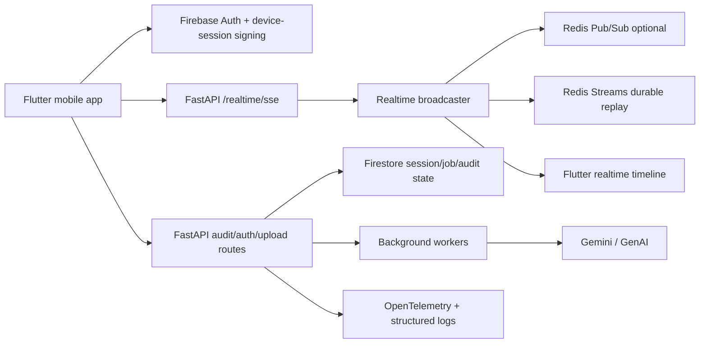

# TitleTrust

TitleTrust is a mobile-first property verification platform for secure document review, geospatial checks, and long-running forensic investigations. The codebase combines a FastAPI backend, Flutter client, realtime SSE delivery, and background workers so investigators can work offline-tolerant while still keeping an auditable trail.

## What the system does

- Authenticates mobile users with Firebase and device-session signing.
- Streams realtime investigation events over SSE from [backend/api/realtime_router.py](backend/api/realtime_router.py).
- Fans out events through [backend/realtime/broadcaster.py](backend/realtime/broadcaster.py) with optional Redis Pub/Sub and Redis Streams durability.
- Runs forensic and geospatial verification through [backend/forensic_engine.py](backend/forensic_engine.py), [backend/geospatial_engine.py](backend/geospatial_engine.py), and [backend/agent/marathon_loop.py](backend/agent/marathon_loop.py).
- Persists authoritative session and job state in Firestore.

## Architecture



## Key entry points

- Backend app: [backend/main.py](backend/main.py)
- Realtime API: [backend/api/realtime_router.py](backend/api/realtime_router.py)
- Realtime broadcaster/store: [backend/realtime/broadcaster.py](backend/realtime/broadcaster.py), [backend/realtime/store.py](backend/realtime/store.py)
- Forensic and geospatial engines: [backend/forensic_engine.py](backend/forensic_engine.py), [backend/geospatial_engine.py](backend/geospatial_engine.py)
- Marathon agent loop: [backend/agent/marathon_loop.py](backend/agent/marathon_loop.py)
- Flutter realtime client: [frontend/titletrust/lib/realtime/realtime_service.dart](frontend/titletrust/lib/realtime/realtime_service.dart), [frontend/titletrust/lib/realtime/realtime_controller.dart](frontend/titletrust/lib/realtime/realtime_controller.dart)

## Realtime contract

- SSE endpoint: `/realtime/sse`
- Recovery endpoint: `/realtime/last-state/{session_id}`
- Health endpoint: `/realtime/health`
- Debug endpoints: `/realtime/debug/subscribers`, `/realtime/debug/streams`

The client sends `Last-Event-ID` on reconnect, dedupes by `event_id`, and uses local recovery state from [frontend/titletrust/lib/realtime/recovery_coordinator.dart](frontend/titletrust/lib/realtime/recovery_coordinator.dart) when gaps appear.

## Getting started

Backend quick start:

```bash
python -m venv .venv
source .venv/bin/activate
pip install -r requirements.txt
uvicorn backend.main:app --reload
```

Frontend quick start:

```bash
cd frontend/titletrust
flutter pub get
flutter run
```

## Testing

Recommended commands:

```bash
source .venv/bin/activate
python -m pytest -q tests/test_realtime_broadcaster.py tests/test_realtime_integration.py tests/test_realtime_chaos.py
cd frontend/titletrust && flutter test
```

## API documentation

The FastAPI OpenAPI surface is available at `/openapi.json`, with interactive docs at `/docs` and `/redoc` when the API is running.

## Contributing

Please read [CONTRIBUTING.md](CONTRIBUTING.md) before opening a pull request. It covers setup, coding style, branching, commit messages, and issue reporting expectations.


