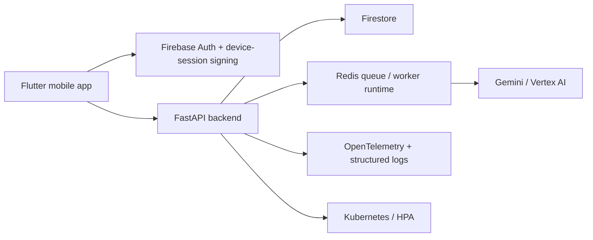

# TitleTrust

TitleTrust is a mobile-first property verification platform for secure document review, geospatial checks, and long-running forensic investigations. The repository is structured so the Flutter client, FastAPI backend, workers, and observability stack can evolve independently without losing traceability or operational control.

## Architecture




## Getting Started

The repo contains two independently runnable applications:

* Backend: [backend/main.py](backend/main.py)
* Frontend: [frontend/titletrust/lib/main.dart](frontend/titletrust/lib/main.dart)

Backend quick start:

```bash
python -m venv venv
source venv/bin/activate
pip install -r requirements.txt
uvicorn backend.main:app --reload
```

Frontend quick start:

```bash
cd frontend/titletrust
flutter pub get
dart run build_runner build --delete-conflicting-outputs
flutter run
```

## Testing

The repo already includes backend unit and integration coverage plus a small Flutter test suite. 
Recommended commands:

```bash
pytest backend/tests -q
flutter test
```

## API Documentation

The backend uses FastAPI, so the generated OpenAPI surface is available from `/openapi.json`, with interactive docs at `/docs` and `/redoc` when the API is running.

## Contributing

Please read [CONTRIBUTING.md](CONTRIBUTING.md) before opening a pull request. It covers setup, coding style, branching, commit messages, and issue reporting expectations.


