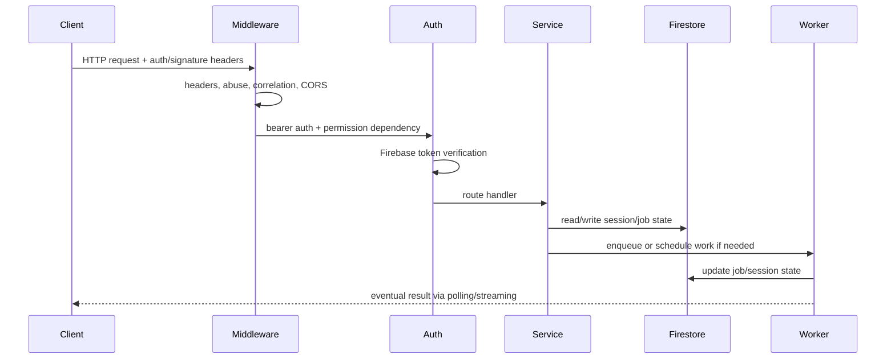

# TitleTrust Engineering Flows

This document explains how the system actually executes: middleware order, request lifecycle, job orchestration, telemetry, storage, and failure policy.

Core runtime anchors:
- Request bootstrap: [backend/main.py](backend/main.py)
- Correlation and metrics: [backend/middleware/observability.py](backend/middleware/observability.py)
- Abuse middleware: [backend/middleware/adaptive_protection.py](backend/middleware/adaptive_protection.py)
- Rate limiting: [backend/middleware/rate_limit.py](backend/middleware/rate_limit.py)
- Request signing: [backend/security/request_signing.py](backend/security/request_signing.py)
- Queue runtime: [backend/queues/redis_queue.py](backend/queues/redis_queue.py), [backend/workers/runtime.py](backend/workers/runtime.py)
- Session lifecycle: [backend/services/session_service.py](backend/services/session_service.py), [backend/services/background_job_service.py](backend/services/background_job_service.py)

## 1) Middleware Ordering

The backend installs middleware in this order in [backend/main.py](backend/main.py):

1. Advanced security headers
2. Adaptive abuse protection
3. Correlation middleware
4. CORS middleware
5. Route-level bearer auth and permission dependencies
6. Route-level rate limiting via router dependencies

Why this order matters:
- Security headers are response-only and should wrap everything.
- Abuse protection must see the request before business logic.
- Correlation ids must exist before logs, metrics, and downstream service calls.
- CORS must be able to reject or shape browser-origin traffic before handler execution.
- Auth and rate limiting are route-scoped, not global, so they can depend on the concrete permission required by a route.

Operational tradeoff:
- Putting abuse detection and correlation in middleware gives low overhead and consistent observability, but it also means all requests pay the cost, even the ones that will be rejected later.

## 2) Request Lifecycle

Happy path:

The request path is intentionally layered:
- Edge controls reject abusive or over-limit traffic before business logic.
- Identity is established through Firebase token verification in [backend/auth.py](backend/auth.py).
- Authorization is evaluated against role and policy state in [backend/core/authorization.py](backend/core/authorization.py).
- Data mutations happen through repository objects rather than direct Firestore writes in route handlers.

## 3) Correlation and Tracing Propagation

The correlation middleware in [backend/middleware/observability.py](backend/middleware/observability.py):
- Uses incoming `X-Correlation-ID` or generates a new UUID.
- Stores it on `request.state.correlation_id`.
- Emits `X-Correlation-ID` and `X-Response-Time-Ms` on the response.
- If OpenTelemetry is available, starts a span per request and emits a trace id header.

This is the spine that ties together:
- client telemetry keys in [frontend/titletrust/lib/telemetry/frontend_telemetry_service.dart](frontend/titletrust/lib/telemetry/frontend_telemetry_service.dart)
- audit events in [backend/repositories/audit_event_repository.py](backend/repositories/audit_event_repository.py)
- request-signing payloads in [backend/security/request_signing.py](backend/security/request_signing.py)
- worker job events in [backend/events/job_events.py](backend/events/job_events.py)

Tradeoff:
- Correlation ids are easy to propagate and cheap to log, but they do not by themselves guarantee causality across Firestore streams or Cloud Tasks. They are an observability primitive, not a consistency primitive.

## 4) Abuse Scoring and Fail-Closed Behavior

Adaptive protection in [backend/middleware/adaptive_protection.py](backend/middleware/adaptive_protection.py) evaluates every request before route execution.

Inputs:
- tenant id
- device id
- IP address
- user agent
- method/path
- correlation id
- request headers
- session context if available

Scoring sources in [backend/security/abuse_detection.py](backend/security/abuse_detection.py):
- request fingerprint entropy
- threat-intelligence store hits
- quarantined fingerprints
- clustered request bursts
- velocity anomalies
- session risk signals from [backend/security/anomaly_detection.py](backend/security/anomaly_detection.py)
- credential-stuffing heuristics

Actions:
- allow
- throttle
- challenge
- quarantine
- block

Why this design exists:
- It catches suspicious traffic before business handlers allocate expensive resources.
- It allows more than one signal to contribute to a decision, instead of relying on IP alone.

Failure mode:
- If the middleware classifies a request as block, the request never reaches the route handler. That is a deliberate fail-closed behavior.

Operational benefit:
- The system can respond to a live abuse wave with measurable headers and metrics without changing application code.

## 5) Rate Limiting

[backend/middleware/rate_limit.py](backend/middleware/rate_limit.py) derives its key from path + IP + auth principal or device-session principal.

Important property:
- User-controlled identity headers are ignored. The tests in [backend/tests/test_rate_limit.py](backend/tests/test_rate_limit.py) verify that `x-user-id` does not affect the key.

Why this matters:
- The app does not trust caller-provided principal labels for quota enforcement.
- The limiter can still separate authenticated principals behind the same IP.

Tradeoff:
- This is strong enough for API abuse control, but it is not a replacement for policy-based authorization or per-resource quotas.

## 6) Request Signing and Device-Session Rotation

Request-signing logic in [backend/security/request_signing.py](backend/security/request_signing.py):
- Builds a canonical payload from method, path, timestamp, correlation id, and body hash.
- Produces an HMAC-SHA256 signature using the per-device secret.
- Rejects signatures older than 5 minutes.

Backend verification in [backend/api/auth_router.py](backend/api/auth_router.py):
- Extracts the body once and caches it on request state.
- Verifies the current secret.
- If rotation is underway, accepts the previous secret as a fallback.

Device session storage in [backend/services/device_session_service.py](backend/services/device_session_service.py):
- Encrypts the active secret at rest.
- Stores the secret fingerprint.
- Preserves previous ciphertext and fingerprint on rotation.
- Deletes secret fields on revoke via [backend/repositories/device_session_repository.py](backend/repositories/device_session_repository.py).

Why this design exists:
- It gives the mobile client an integrity token that is not the Firebase identity token.
- It makes replay and tamper detection possible even on signed traffic.

Operational benefit:
- Rotation is backward-compatible for a period, so the app can recover from client updates or secure-storage resets without breaking all active devices.

## 7) Firestore Repository Pattern

The repository layer centralizes Firestore access:
- [backend/repositories/session_repository.py](backend/repositories/session_repository.py)
- [backend/repositories/job_repository.py](backend/repositories/job_repository.py)
- [backend/repositories/device_session_repository.py](backend/repositories/device_session_repository.py)
- [backend/repositories/policy_repository.py](backend/repositories/policy_repository.py)
- [backend/repositories/audit_event_repository.py](backend/repositories/audit_event_repository.py)

Patterns used:
- create-or-fail for sessions
- set with merge for updates
- collection-scoped lookups for ownership checks
- append-only audit trails with sequence and hash chaining

Why this matters:
- It keeps route handlers thin and makes state transitions auditable.
- The audit event repository creates a hash chain, so tampering is easier to detect.

Scaling implication:
- Hot documents are limited to session/job roots rather than scattered ad hoc writes.

## 8) Queue and Worker Lifecycle

Queue abstraction in [backend/queues/redis_queue.py](backend/queues/redis_queue.py):
- `enqueue()` pushes an envelope to a Redis list.
- `pop()` uses blocking pop with a timeout.
- `set_heartbeat()` keeps worker liveness visible.
- `cancel()` marks jobs cancelable through a Redis key.

Worker runtime in [backend/workers/runtime.py](backend/workers/runtime.py):
- Sets heartbeat and queue-depth gauges.
- Reads envelopes from Redis.
- Updates job state to RUNNING.
- Runs the handler under circuit breaker protection.
- Retries with exponential backoff and jitter.
- Sends poison jobs to the dead-letter repository.

Why this design exists:
- The API can hand off long-running work and return quickly.
- The worker can be scaled independently from the API.
- The system survives transient model/API failures without instantly failing the user request.

Failure modes:
- Queue unavailable: the background service falls back to background tasks in process.
- Circuit breaker open: the job is deferred.
- Poison pill or max retries exceeded: the job is dead-lettered.

## 9) Retry Semantics and Idempotency

Session creation in [backend/services/session_service.py](backend/services/session_service.py):
- Honors an idempotency key before creating a new marathon session.
- Stores idempotency mappings in Firestore.

Job retries in [backend/workers/runtime.py](backend/workers/runtime.py):
- Retry count increments on each failure.
- The retry delay increases exponentially with jitter.
- Terminal failure writes to dead-letter storage.

Why this matters:
- The client can safely retry POST flows without duplicating long-running investigations.
- The worker can recover from model or transient transport failures without inconsistent state.

## 10) Telemetry, Metrics, and Logging

Frontend telemetry in [frontend/titletrust/lib/telemetry/frontend_telemetry_service.dart](frontend/titletrust/lib/telemetry/frontend_telemetry_service.dart):
- Crashlytics captures Flutter and platform errors.
- Sentry captures handled exceptions.
- Package version and connectivity are recorded.

Backend telemetry in [backend/telemetry/init.py](backend/telemetry/init.py):
- Initializes OTLP tracing and metrics only if endpoints are configured.
- Instruments FastAPI and outgoing requests when available.

Built-in Prometheus metrics:
- HTTP request count and latency in [backend/middleware/observability.py](backend/middleware/observability.py)
- Abuse assessments and blocks in [backend/middleware/adaptive_protection.py](backend/middleware/adaptive_protection.py)
- Worker heartbeat, queue depth, active jobs, and job counters in [backend/workers/runtime.py](backend/workers/runtime.py)

Why this design exists:
- The system keeps observability lightweight and optional for local development.
- Metrics are exposed close to the runtime surfaces that generate them.

Operational benefit:
- The repo includes explicit dashboards and alerting rules under [ops/dashboards](ops/dashboards) and [ops/alerts](ops/alerts).

## 11) Why the Architecture Looks This Way

The codebase is trying to solve a few distinct engineering problems at once:
- authenticated mobile access
- integrity-protected API calls
- long-running AI workloads
- Firestore-backed persistence
- live operator visibility into abuse and job health

The design choice that stands out most is the combination of:
- Firebase identity for user authentication
- device-session signing for transport integrity
- policy-driven authorization for org/resource access
- queue-backed workers for expensive model workloads
- Firestore streams for live session visibility

That layering is why the system can look simple from the UI while still carrying a fairly serious trust and runtime model underneath.
