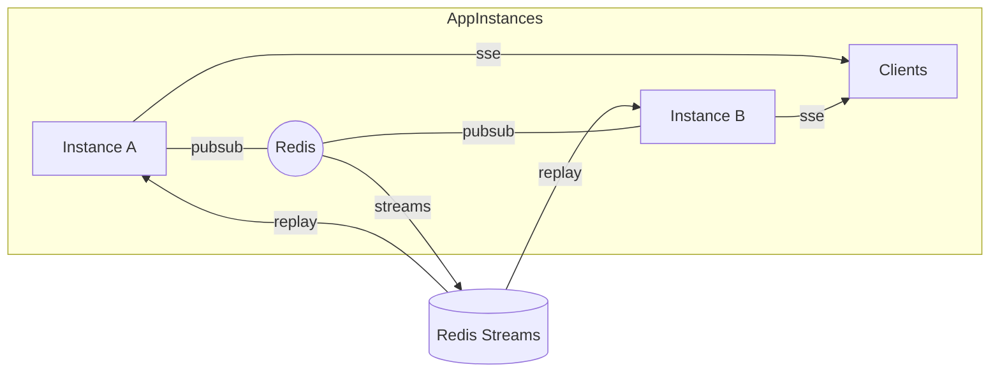
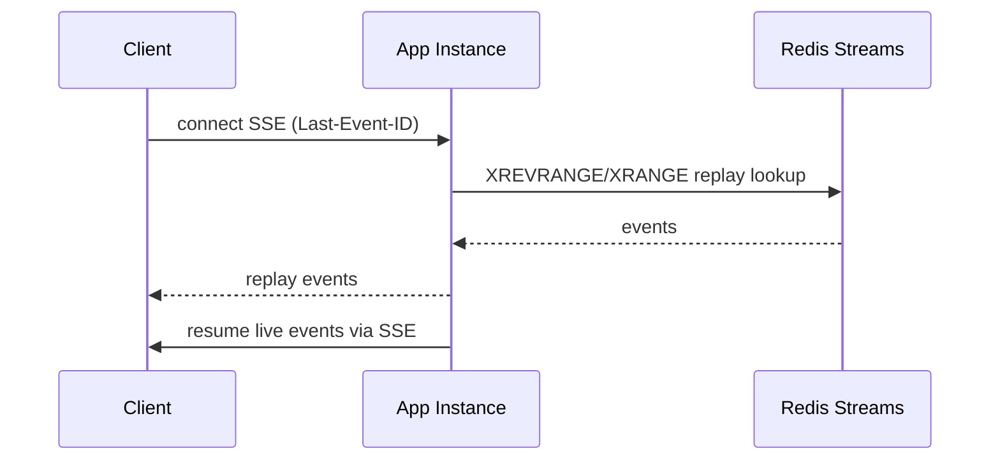
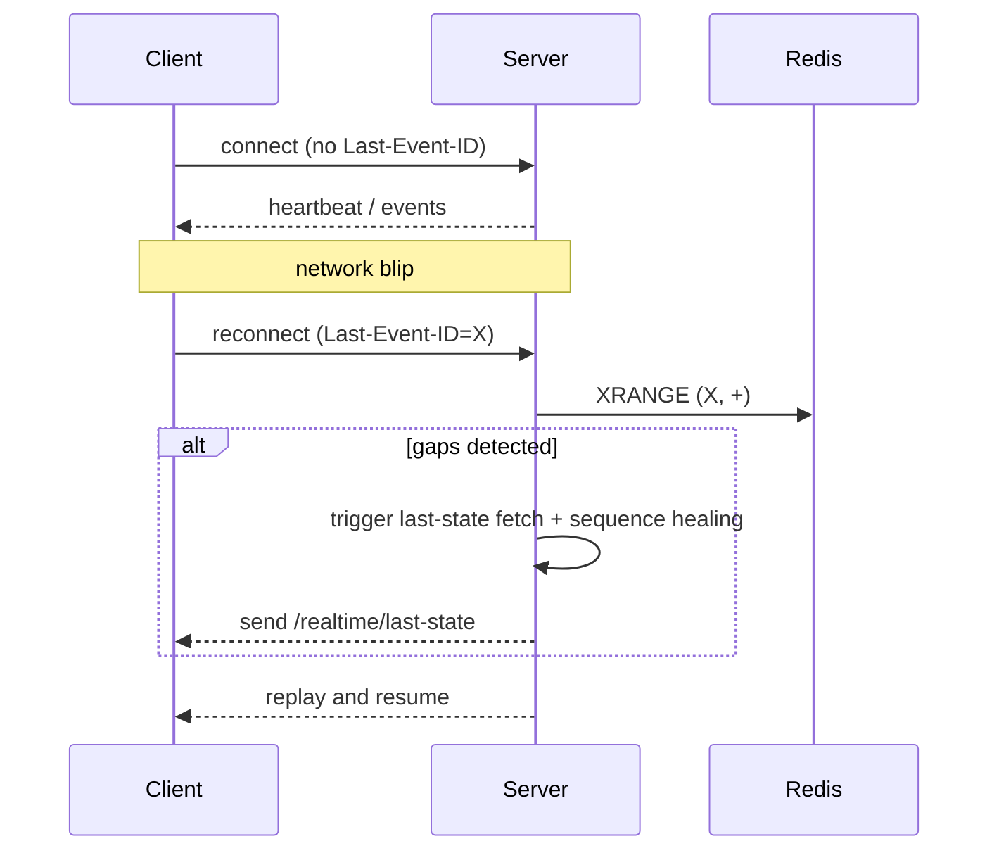
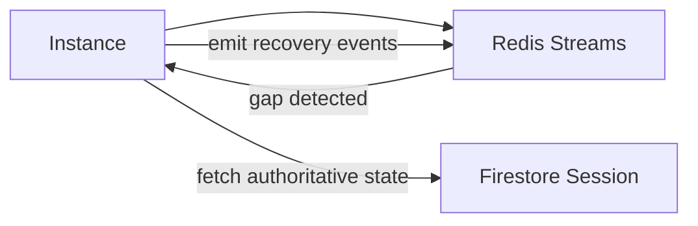

Realtime Subsystem - Operations and Recovery

This document summarizes the production operations, failure modes, and client recovery contract for the TitleTrust realtime subsystem.

**Deployment Topology (Mermaid)**

**Redis Streams replay flow**

**SSE reconnect sequence**

**Sequence healing (conceptual)**

Frontend recovery contract

- On reconnect, client MUST include `Last-Event-ID` header.
- The server-side SSE router uses `broadcaster.register(last_event_id=...)` to replay recent entries from Redis Streams or the in-memory buffer.
- The client should fetch `/realtime/last-state/{session_id}` when a gap is detected, reconcile optimistic UI state, then resume the SSE stream.
- The client should dedupe events by `event_id` and maintain ordering by `sequence_id` per `session_id`.

Client reconnect flow (summary):
1. reconnect SSE with `Last-Event-ID`
2. if server signals gap or the controller sees missing sequence numbers → fetch `/realtime/last-state/{session_id}`
3. reconcile optimistic state (idempotent apply)
4. resume streaming and resume local playback

Operational checks exposed by `/realtime/health` and `/realtime/debug/*`:
- active subscribers
- replay buffer utilization
- Redis ping/stream length
- recent stream entries

Chaos scenarios to validate during SRE testing

- Redis restart mid-stream (expect degraded fallback and no crash)
- Worker crash during publish (expect replay on restart)
- Network partition between instances and Redis (expect degraded mode and eventual healing)

*** End File
