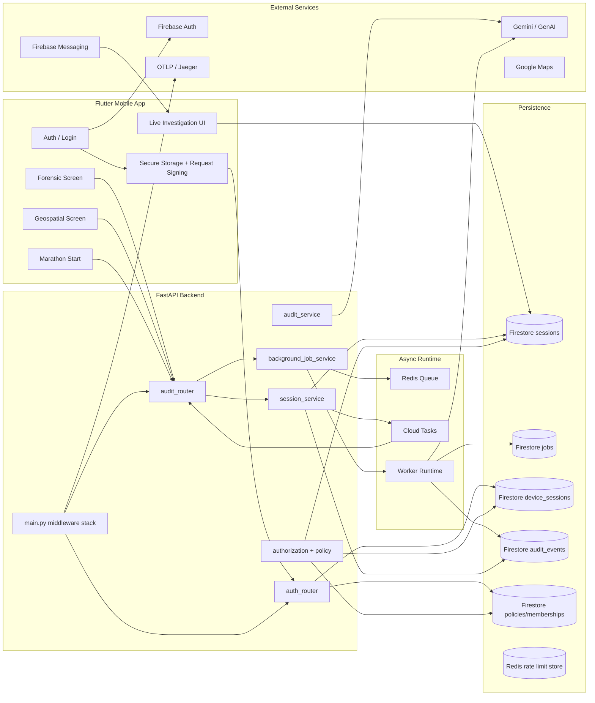
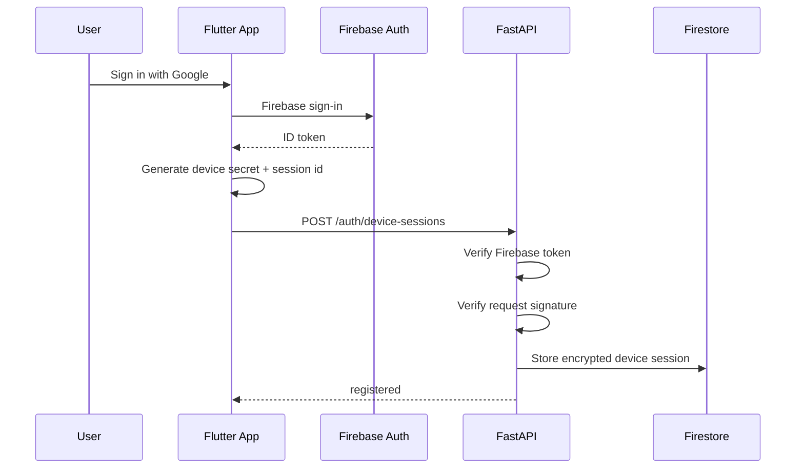
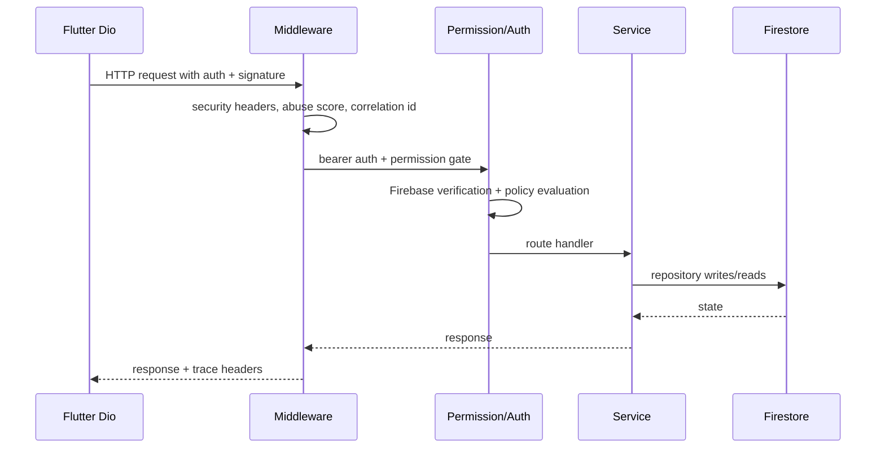
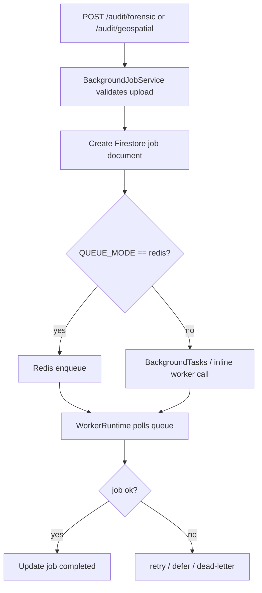
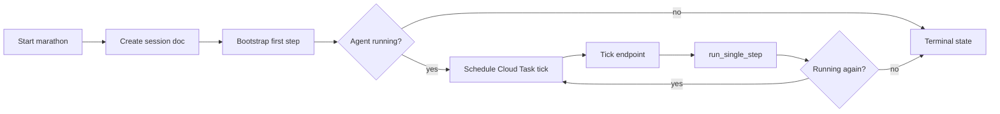
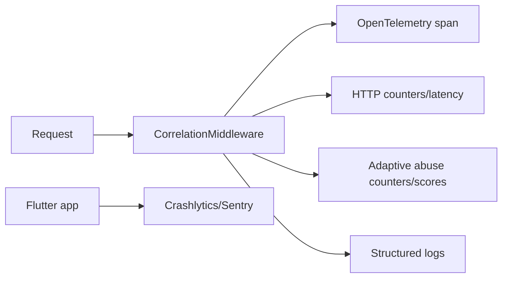

# TitleTrust System Architecture

This is the architecture that emerges from the code, not a marketing diagram.

## High-Level Component Map

## Runtime Layers

### Client layer
The Flutter app is not a thin demo shell. It includes:
- auth and biometric gating
- local secure storage
- request signing and correlation headers
- file uploads and camera/location capture
- Firestore stream consumption for live investigation state

### API layer
The FastAPI backend owns:
- token verification
- request-signing verification
- policy and permission enforcement
- file validation
- session/job persistence
- dispatch to background work

### Worker layer
The worker owns:
- long-running forensic analysis
- geospatial model invocation
- retries and backoff
- dead-letter routing
- heartbeat and queue-depth metrics

### Data layer
Firestore is the system of record for:
- sessions
- jobs
- audit trails
- device sessions
- policy/membership state

Redis is used for:
- distributed queueing
- rate limiting
- worker cancellation markers
- heartbeats and queue depth observation

## Auth Lifecycle Diagram

What is notable here:
- authentication and transport integrity are separate concerns
- the device session binds the app install to future requests
- backend authorization still applies after auth succeeds

## Request Lifecycle Diagram

## Queue Lifecycle Diagram

Key design point:
- queueing is a runtime choice, not a hardcoded single path. The code supports local development without Redis while preserving the same job semantics.

## Investigation Lifecycle

Important behavior:
- state is persisted in Firestore so the agent can be resumed after process restarts
- Cloud Tasks is only the scheduler; the actual reasoning state lives in the session document

## Telemetry Lifecycle

Why this architecture matters:
- it keeps the correlation id visible across client, API, and worker surfaces
- it gives operations a consistent handle to trace a single incident
- it allows the backend to run without telemetry exporters configured, which is useful for development and failure recovery

## What Is Interesting About This Architecture

This is a hybrid of:
- mobile-first UX
- trust-boundary-heavy API design
- workflow orchestration with persisted state
- AI-in-the-loop investigation
- observability-first runtime hygiene

The engineering value is not the UI chrome. It is the fact that the codebase explicitly models:
- request integrity
- job lifecycle
- policy evaluation
- audit trails
- worker resilience
- abuse detection
- partial degradation in local and cloud environments

That is the actual system shape.
